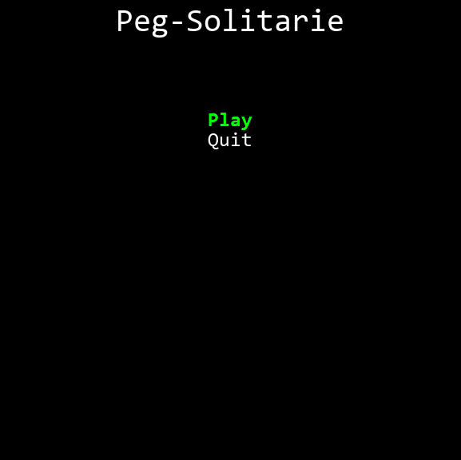
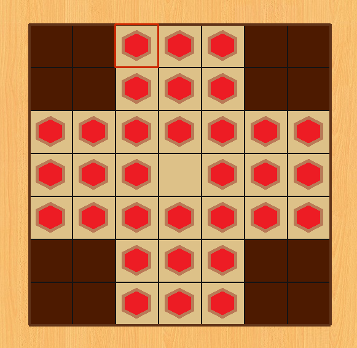

# Python peg solitarie board game

## Imports

This game imports the following modules:

* pygame;
* time;
* os.

## Description

This is a board game in which your objective is to leave just one piece remaining in the board.

* You can move only one piece per move. 
* The movements are made in four directions: UP, DOWN, LEFT and RIGHT. 
* To move a piece it must pass "over" the piece next to it, when you move a piece automatically, the piece that was next to it is removed from the board. 
* You can move a piece to some place __only__ if it's a blank space.

> This is actually not the repository I originally worked in this game, to see the developing process, take a look at my [deprecated repository](https://github.com/GabrielEspanholSantos/hunter-sDungeon)

## How to play 

Use the four standard arrows of your keyboard to walk through the pieces in the board. Then, press the ENTER key to select the piece you want to be moved and then, go to the position in which you want to move the piece in and press the ENTER key again to actually move it.
